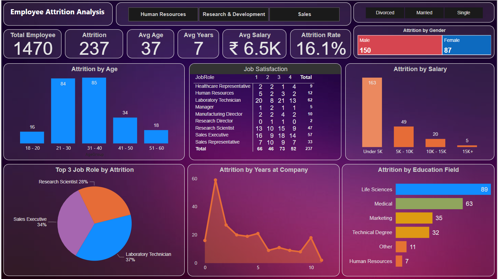

# Employee Attrition Analysis 

## Project Description:
In this project, I analyze employee data to understand the factors that contribute to employee attrition. Employee attrition can be costly for 
businesses, and identifying the root causes can help in retention effort.

## Project Demo:

## Tools:

-  Power BI Desktop -> [Download](https://powerbi.microsoft.com/en-in/desktop/)

## Data Source:

I have used "***IBM HR Analytics Employee Attrition***". [Click Here](./HR-Employee-Attrition.csv) to see the dataset.

Original Source: https://www.kaggle.com/datasets/pavansubhasht/ibm-hr-analytics-attrition-dataset

> It is recommended by Coding Samurai.

## Analysis Process:

First I have applied ETL(Extract, Transform, Load) process before analysis.

- **Data Extraction** - Download the dataset from 
kaggle
- **Data Transformation** - open the dataset through Power BI and then transform data by applying following steps:
    + Clean the dataset to handle missing values.
    + format the data column to get proper outcomes.
    + used Measure, Conditional Column formating, DAX Query, etc. to get proper outcomes effectively for analysis. 

- **Data Loading** - After all above process, load data into Power Bi for analysis and visualization.

## Data Visualization:

- For KPIs calculation, I have used Number Card visuals.
- Column chart is used to show attrition by Age group and Salary slab.
- Tree Map is used for attrition distribution based on Gender.
- Bar chart is used to show attrition by Education field.
- Pie chart shows Top 3 Job role
- Line Area chart shows attrition by "Years at Company".

## Key Performance Indicators(KPIs):

- Total Employees = 1470
- Total Attrition = 237
- Attrition Rate = 16.1%
- Avg. Salary = 6.5K
- Avg. Years of Retentio = 7 years
- Avg. Age = 37

*Note: Price is mentioned in Indian Currency*

## Insights & Findings:

- Top 3 job Role
    + Laboratory Technician
    + Sales Executive
    + Research Scientist

- Most Attrition by Age group
    + 21 - 40 yrs

- Attrition by Salary slab 
    + under 5K

- Most Attrition by Education Field
    + Life Science
    + Medical

## Dashboard:

## Recommendations: 

- Based on my analysis, it is recommended that HR dept. might look into some dept. where most attrition is occured and may provide additional and better benefits, improve managemenet for better retention.

- Provide trainings to specific qualified employees like Life Science, Medical, Marketing etc. field.

- Need to better salary increment and easy promotion process for retention of experienced employees. 

